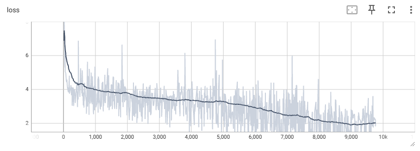
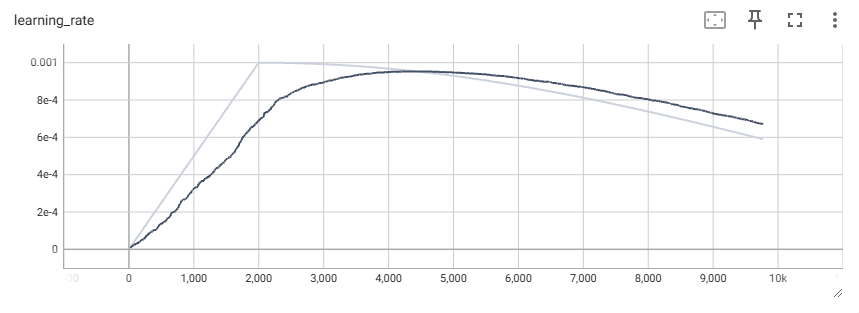

# bafoGPT

🌐 [Homepage](#) | 🤗 [Hub](https://huggingface.co/ChallengerSpaceShuttle/continued-trained-gemma2-2b)  | [GitHub](https://github.com/Motsepe-Jr/bafoGPT)

## Overview

Presenting BafoGPT-2-2B-base and BafoGPT-2-2B-it, open-source Zulu language models derived from the Gemma-2-2b architecture. These models underwent continuous pre-training on approximately 200 million tokens over 36 hours using 4 L40 GPUs. With a budget of under R10,000, they deliver performance comparable to models that typically require millions of dollars to train from scratch. 

Licensed under the permissive Gemma-2 and Apache 2.0 licenses, these models support both commercial use and further innovation. BafoGPT-2-2B-base is designed for both IsiZulu and English languages, promoting research and innovation in African AI development. I hope this work inspires further contributions and advancements in this space.


## News

🔥 **[2024/08/20]:** The pretraining code has been released, and we also invite you to follow our Repo. 😆

## Main Contributions of this Project 

- **Vocab Expansion**: Expanded the Gemma-2-2B vocabulary size with 40,000 Zulu tokens for enhanced encoding/decoding efficiency.
- **Largest IsiZulu Dataset**: Open-sourced the largest IsiZulu supervised fine-tuning and pretraining datasets.
- **Large-Scale Data Collection and Processing Scripts**: Includes a separate repository for collecting, cleansing, and processing datasets.
- **Open Source**: Open sourcing both BafoGPT-2-2B-base and BafoGPT-2-2B-it, Our work is made possible by the open-source community. Special thanks to the teams behind [LitGPT](https://github.com/Lightning-AI/litgpt) and [Google's research](https://arxiv.org/pdf/2403.08295).

## Dataset

### Pretraining Dataset: 🤗 [Hub](https://huggingface.co/datasets/ChallengerSpaceShuttle/zulu-pretraining-dataset)

For the pretraining of **BafoGPT**, I collected diverse internet-based data sources focused on both Zulu and English to facilitate bilingual understanding. The curriculum learning approach I employed was designed to help the model efficiently grasp the intricacies of Zulu by initially feeding it simpler datasets. The dataset was processed without shuffling, starting from simpler dictionary where zulu words are explained in English and progressing to more complex structures such as translated texts and transcriptions. 
 
- ** My hypothesis was that by starting continual pretraining with Zulu words defined in English, the base model would adjust its internal representations to map these Zulu words closer to their English counterparts, all while avoiding catastrophic forgetting.

The model first learn to map Zulu words and sentences to their English equivalents,  progressing to more complex data soruce such as wikipedia, new articles etc.

- **Books**: [Zulu-English Dictionary](https://archive.org/details/zuluenglishdicti00brya) – A dictionary offering Zulu terms with English definitions, ideal for teaching basic word mappings.
- **Translation**: [South African Government Speeches](https://www.gov.za/news/inkulumo-echaza-isimo-sezwe-ithulwa-ngumhlonishwa-jg-zuma-umongameli-weriphabhulikhi) – Official speeches in Zulu, which help the model understand structured Zulu sentences and phrases.
- **Transcription**: [Zulu Community Corpus](https://corpora.uni-leipzig.de/en?corpusId=zul_community_2017) – A collection of transcriptions, exposing the model to real-life conversational Zulu.
- **Document**: [Leipzig Corpora Collection](https://wortschatz.uni-leipzig.de/en) – Text from various Zulu documents, helping the model understand written Zulu.
- **News**: [Isolezwe News](https://www.isolezwe.co.za/) – Zulu-language news articles for understanding contemporary Zulu language usage and current affairs.
- **Poems**: [Zulu Poetry](http://inkondlo_kazulu.co.za) – Poetry resources for cultural and literary language representation.
- **Web**: Various websites – Diverse web-scraped content in Zulu, providing a wide range of linguistic inputs.
- **Wikipedia**: [Zulu Wikipedia](https://zu.wikipedia.org/wiki/) – Articles in Zulu covering various topics, offering an informative and factual base for the model.

### Fine-tuning Dataset 🤗 [Hub](https://huggingface.co/datasets/ChallengerSpaceShuttle/zulu-finetuning-dataset)

For the fine-tuning phase, I leveraged large-scale datasets translated into Zulu. This included translating the entire **Cosmopedia** dataset from Hugging Face, along with a **WikiHow** dump translated into Zulu. The innovative aspect of this process was to train the model using bilingual question-answering pairs, where questions were posed in Zulu, and the model responded in English. This forced the model to not only understand Zulu but also to navigate between both languages effectively.

By training BafoGPT this way, I encouraged cross-lingual knowledge transfer, enhancing the model’s capability to understand and generate coherent text in both Zulu and English. This fine-tuning method provided a robust base for both translation and generation tasks in these languages.

## Tokenizer 🤗 [Hub](https://huggingface.co/ChallengerSpaceShuttle/continued-trained-gemma2-2b)

The tokenizer for **BafoGPT** was designed to handle Zulu text more efficiently, especially considering the challenges posed by long sequence lengths in transformer architectures. The goal was to reduce the computational burden associated with the quadratic scaling of the attention mechanism.

To achieve this, I trained the tokenizer on the pretraining dataset using Byte-Pair Encoding (BPE), generating 40,000 sub-tokens/sub-words. This choice of vocabulary size was intended to compress the Zulu text in a way that balances tokenization efficiency with the overall model performance during training and inference.

The newly generated 40,000 Zulu-specific tokens were appended to the original **Gemma-2-2B** vocabulary, which had a size of 288256 tokens (excluding duplicates and padded). The BPE tokenizer compresses Zulu text effectively, thereby reducing the number of tokens needed to represent a given sequence. This, in turn, lessens the impact of the **n² attention** complexity, optimizing both training and inference times without compromising the model’s ability to understand complex linguistic structures in Zulu.

The tokenizer training code can be found in the following directory:  
**`tokenization/train_tokenizer.py`**

## Training 🤗 [Hub](https://huggingface.co/ChallengerSpaceShuttle/continued-trained-gemma2-2b)

With the tokenizer in place, the next step was to initialize the model's embedding table (`wte`) to accommodate the expanded vocabulary. The 40,000 newly generated Zulu-specific tokens were appended to the original Gemma-2-2B vocabulary. To ensure smooth training and faster convergence, I initialized the embeddings for the new Zulu tokens by averaging the embedding vectors from the original Gemma-2-2B base embeddings.

Additionally, for improved training stability and better performance on the GPU, I made sure that the new Zulu tokens were added in multiples of 64. This was necessary because the vocabulary size determines the dimensions of matrix multiplications in the output layer of the model, and these operations are highly sensitive to alignment. NVIDIA’s documentation suggests that alignment to 64 elements yields better performance due to optimized matmul operations, significantly boosting throughput during training.

#### Infrastructure Setup

I used 4 L40 GPUs for the training process, leveraging a multi-GPU setup for efficient model parallelism. I employed the Fully Sharded Data Parallel (FSDP) strategy to distribute both model parameters and optimizer states across GPUs. This strategy included:

- Full Shard for sharding both model and optimizer states
- Activation Checkpointing and Gradient Checkpointing to reduce memory usage and

For the training configuration please check the yaml from the repo. Below is the training loss of 10-000 training steps. 



#### Hyperparameters: Learning Rate Warmup and Maximum Learning Rate

Before training, two key hyperparameters need attention: **learning rate warmup** and **maximum learning rate**.

- **Learning Rate Warmup**: This involves starting with a low learning rate and gradually increasing it to a maximum value over a set number of steps. [Gupta et al](https://openreview.net/forum?id=pg7PUJe0Tl). emphasize that warmup is crucial to avoid large loss spikes when training begins on new data.

- **Maximum Learning Rate**: The warmup rate significantly influences model performance. If set too high, it may cause the model to lose its initial pretraining knowledge. Conversely, a rate that is too low might hinder the model's ability to adapt to new data.

Balancing these hyperparameters is essential for stable and effective training.




## Finetuning

Underway, stay tune for the updates. Scheduled to be complete before 5 September 2024

## References

```bibtex
@misc{litgpt-2023,
  author       = {Lightning AI},
  title        = {LitGPT},
  howpublished = {\url{https://github.com/Lightning-AI/litgpt}},
  year         = {2023},
}
```
```bibtex
@article{jain2023neftune,
    title={NEFTune: Noisy Embeddings Improve Instruction Finetuning},
    author={Jain, Neel and Chiang, Ping-yeh and Wen, Yuxin and Kirchenbauer, John and Chu, Hong-Min and Somepalli, Gowthami and Bartoldson, Brian R and Kailkhura, Bhavya and Schwarzschild, Avi and Saha, Aniruddha and others},
    journal={arXiv preprint arXiv:2310.05914},
    year={2023}
}
```
```bibtex
@article{jain2023neftune,
    title={Continual Pre-Training of Large Language Models: How to (re)warm your model?},
    author={Kshitij Gupta and others},
    journal={arXiv preprint arXiv:2308.04014},
    year={2023}
}
```

## Citation

If you find the model, data, code in our project useful, please consider citing our work as follows:

```bibtex
@misc{litgpt-2023,
  author       = {Hector Motsepe JR},
  title        = {BafoGPT},
  howpublished = {\url{https://github.com/Motsepe-Jr/bafoGPT}},
  year         = {2024},
}
```
